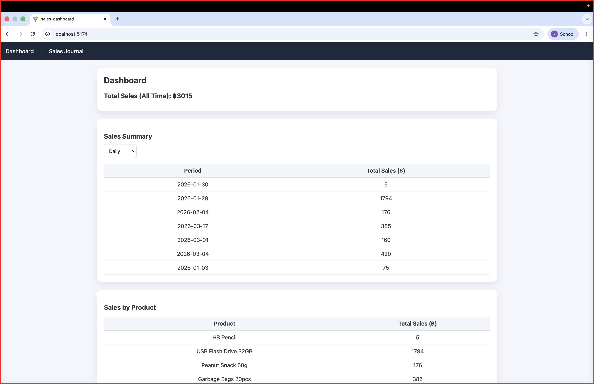
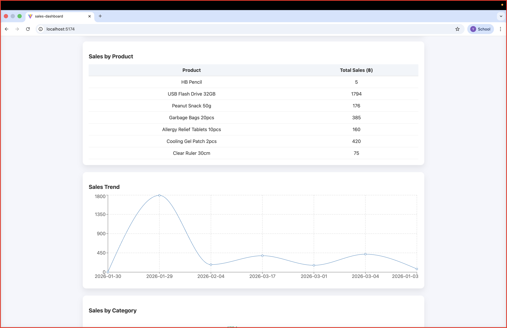
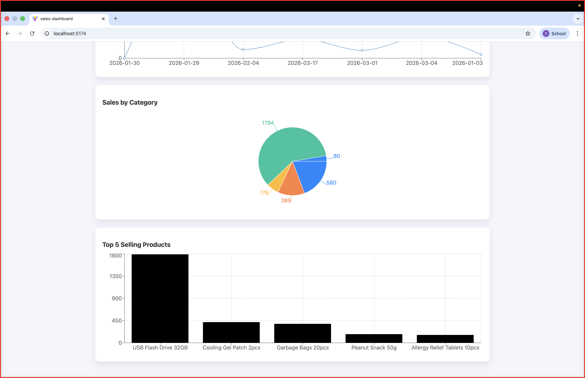
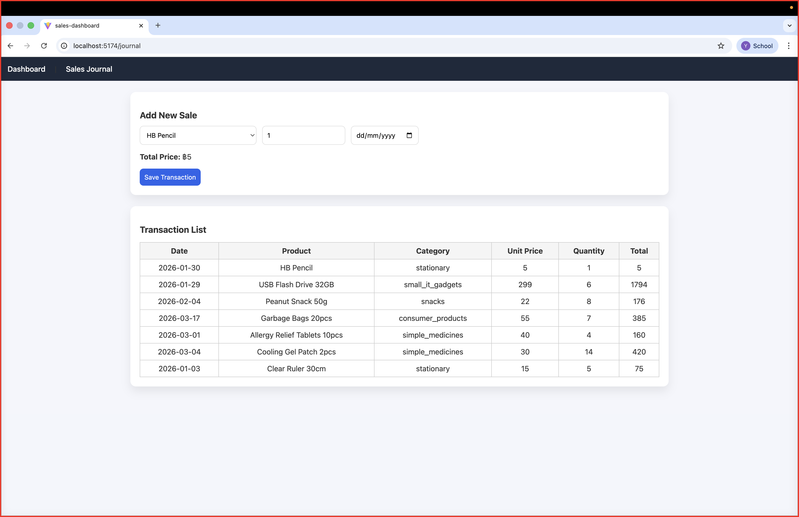

## Sales Dashboard Web Application

A front-end React JS web application for recording sales transactions and visualizing sales data.
This project uses **LocalStorage only** and does **not use any backend service**.

---

## 🚀 Features

### 📊 Dashboard
- Total sales of all time
- Sales trend visualization (Line Chart)
- Sales proportion by category (Pie Chart)
- Top 5 selling products (Bar Chart)
- Sales summary by date

### 🧾 Sales Journal
- Record new sales by selecting:
  - Product
  - Quantity
  - Date
- Automatic total price calculation
- Display all transactions in a table
- Data persistence using LocalStorage

---

## 👥 Team Members
- Yamin Oo
- Kaung Wai Yan
- Mi Hnin Au Shwe Yee

---

## 📸 Screenshots

### Dashboard

### Sales Journal

---

